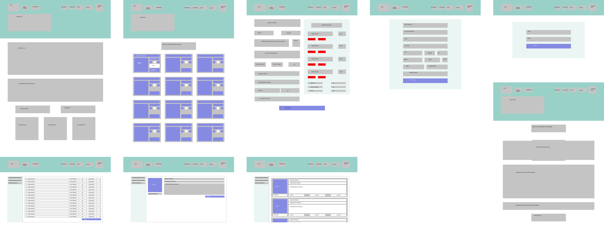
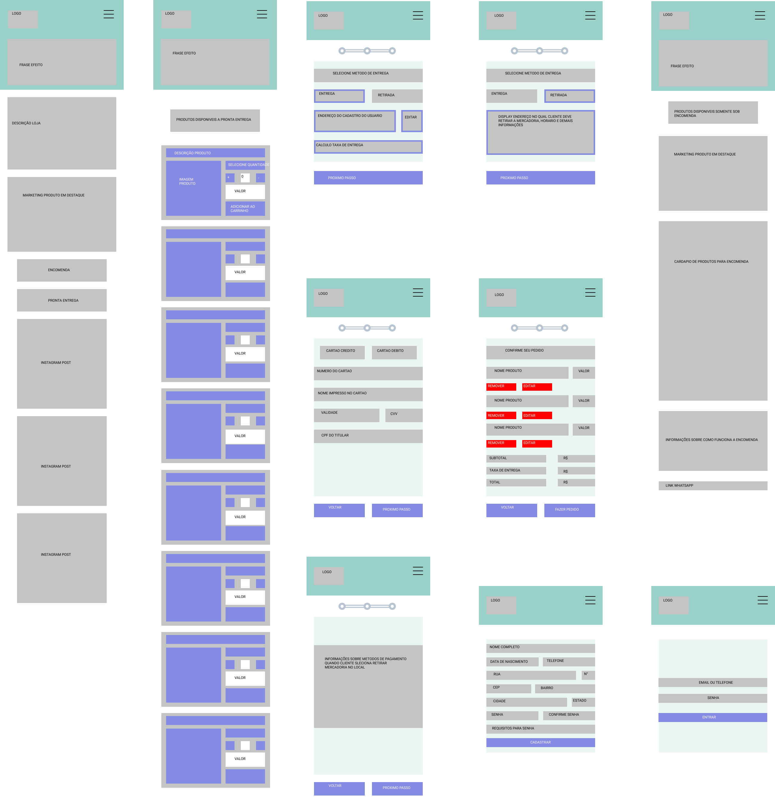

# Sistema eCommerce para pequena empresa do ramo alimentício

# 🎓 Team
**Product Owner/Developer:** João Victor Marinho de Souza  
**Developer:** Diego Rodrigo da Silva  
 
# 📦 Repositórios integrantes do projeto

| Repositório                                                       | Descrição                                                                          |
| ----------------------------------------------------------------- | ---------------------------------------------------------------------------------- |
| [docesGraces](https://github.com/doceGraceseCommerce/docesGraces) | Apresentação e documentação                                                        |
| [client](https://github.com/doceGraceseCommerce/client)           | Aplicação Client com a interface do cliente                                        |
| [admin](https://github.com/doceGraceseCommerce/admin)             | Aplicação Admin com a interface da vendedora                                       |
| [server](https://github.com/doceGraceseCommerce/server)           | Aplicação Server que recebe as requisições do cliente e da vendedora e armazena ou busca no banco |

# 🧰 Tecnologias
**Server:** Java  
**Client:** React  
**Banco:** MySQL  

# 📆 Sprints
| Sprint                                                              | Data de Entrega |
| ------------------------------------------------------------------- | --------------- |
| Sprint 1 | 19 set 2021     |
| 👉**Sprint 2** | 10 out 2021     |
| Sprint 3 | 07 nov 2021     |
| Sprint 4 | 28 nov 2021     |

# 🏁 Desafio
A empresa realiza todo o controle do comérico através de redes sociais, e devido ao cresimento, viu-se necessário o desenvolvimento de uma plataforma web pessoal para maior controle do negócio. 

# ℹ️ Escopo do Produto
O sistema permite gerenciar todos os produtos que a empresa trabalha. A loja funciona com produtos alimentícios disponíveis a pronta entrega e sob encomenda. Através da plataforma sera possivel controle dinâmico dos produtos disponíveis para venda no dia, valor, quantidade. todos os meios de contato com a loja explicitos no site. Cadastro de novos clientes, gerenciador de pagamento online.

# 🧑‍🤝‍🧑 Atores
**Vendedora:** Possui acesso ao banco de produtos da loja, podendo adicionar novos produtos e editar produtos. Possui acesso ao banco de clientes cadastrados. Histórico de vendas. Notificação de nova venda.  
**Cliente:** Possui acesso aos produtos disponíveis na loja, cadastro de perfil.

# ✏️ Wireframes do sistema ecommerce
Figma Link : https://www.figma.com/file/iv7vuSRBC1sm1IrAZabzFA/API-DOCES-GRACES?node-id=0%3A1

# ⚙️ Protótipo do sistema ecommerce
Figma Link : https://www.figma.com/file/IOXaSpGWPkVnwetHDIsPm2/Untitled?node-id=0%3A1

# 📃 Entregas - Backlog

 
| Sprint 1 - Backlog e Wireframe de telas | Conclusão |
| --------------------------------------- | --------- |
| Backlog Total                                        | ✔️         |
| Wireframes do website ecommerce.        | ✔️          |

| Sprint 2 - Cliente consegue visualizar cardápio de produtos | Conclusão |
| ------------------------------------------------------------------- | --------------- |
| Protótipo do website ecommerce.    | ✔️ |
| Cliente - Realizar cadastro no site fornecendo email, nome completo, telefone, data de nascimento, endereço. | ✔️ |
| Cliente - Logar com email e senha no site. | ✔️ |
| Cliente - Página Home do website.    | ✔️ |
| Cliente - Página Cardápio de produtos disponíveis a pronta entrega.    | ✔️ |
| Cliente - Página Cardápio de produtos disponíveis somente sob encomenda.    | ✔️ |
| Cliente - Página de cadastro de novos clientes.    | ✔️ |
| Cliente - Página de login para clientes.    | ✔️ |

| Sprint 3 - Vendedora consegue controlar e cadastrar produtos e vendas e Cliente consegue adicionar produtos ao carrinho                              | Conclusão |
| ------------------------------------------------------------------- | --------------- |
| Vendedora - Cadastrar novos produtos de pronta-entrega. |  |
| Vendedora - Selecionar quantidade de produtos disponíveis a pronta entrega. |  |
| Vendedora - Selecionar quais produtos serão visíveis a clientes no cardápio de pronta entrega. |  |
| Vendedora - Remover produtos disponíveis. |  |
| Vendedora - Editar / excluir produtos cadastrados. |  |
| Vendedora - Página onde a vendedora visualiza / edita / exclui todos os produtos cadastrados. |  |
| Vendedora - Página onde a vendedora determina quais produtos e quantidade estão disponíveis à pronta entrega. |  |
| Vendedora - Página onde a vendedora cadastra novos produtos para pronta entrega. |  |
| Cliente - Selecionar produtos e quantidades e adicionar ao carrinho. |  |
| Cliente - Editar produtos e / ou quantidades selecionadas e / ou adicionadas ao carrinho. |  |
| Cliente - Solicitar orçamento para encomendas por email, whatsapp ou telefone. |  |
| Cliente - Página de produtos adicionados ao carrinho do cliente.    |  |
| Cliente - Página para redigir texto para email de encomenda. |  |

| Sprint 4 - Cliente consegue realizar compra e escolher formas de pagamento e Vendedora controlar status do pedido | Conclusão |
| ------------------------------------------------------------------- | --------------- |
| Vendedora - Receber notificação de pedidos de produtos pronta entrega. |  |
| Vendedora - Receber notificação de solicitação de orçamentos. |  |
| Vendedora - Página onde a vendedora visualiza e altera status dos pedidos recebidos. |  |
| Cliente - Confirmar produtos selecionados no carrinho. |  |
| Cliente - Selecionar formas de envio do produto (retirar no local ou entrega). |  |
| Cliente - Informar local de entrega do produto. |  |
| Cliente - Visualizar taxa de entrega, de acordo com endereço informado pelo cliente. |  |
| Cliente - Consegue visualizar status do pedido. |  |
| Cliente - Página para informar metodo de entrega da compra. |  |
| Cliente - Página para informar endereço de entrega. |  |
| Cliente - Página de pagamento online. |  |
| Cliente - Página para visualizar status do pedido. |  |
| Somente clientes cadastrados podem confirmar produtos do carrinho e realizar pagamentos. |  |
| Produtos são entregues somente em São José dos Campos e em alguns bairros de Jacareí. |  |
| Para entregas, formas de pagamento válidas são somente pelo site. |  |
| Para retiradas, pagamento somente presencial. |  |

# 🎯 Entrega - Sprint 1

## 💻 Telas do Sistema

  

## ⌛ Funcionamento

  

